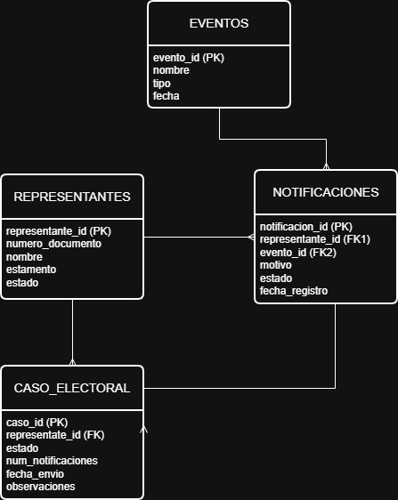
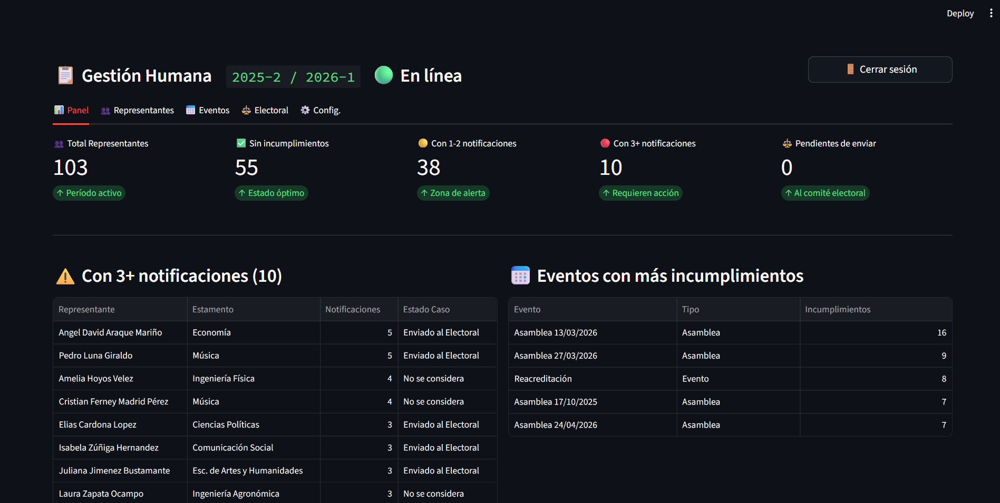
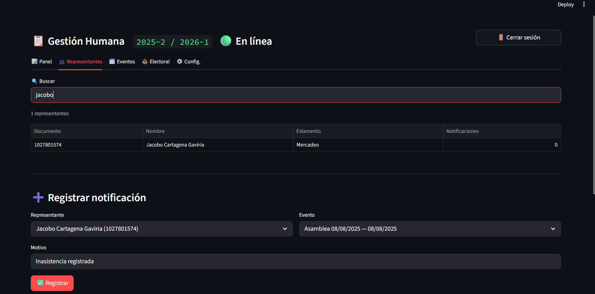
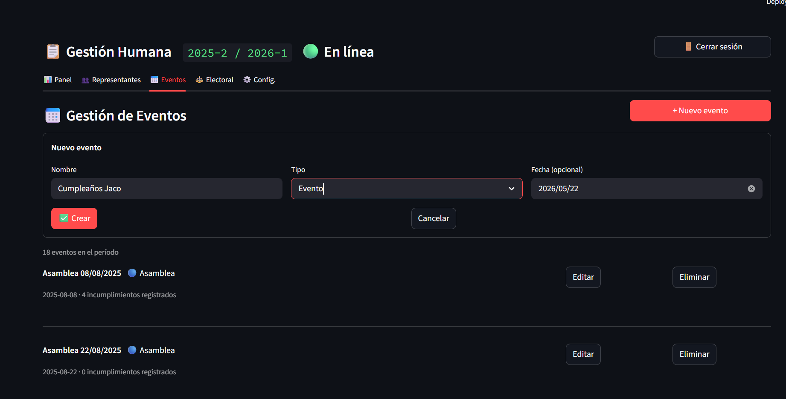
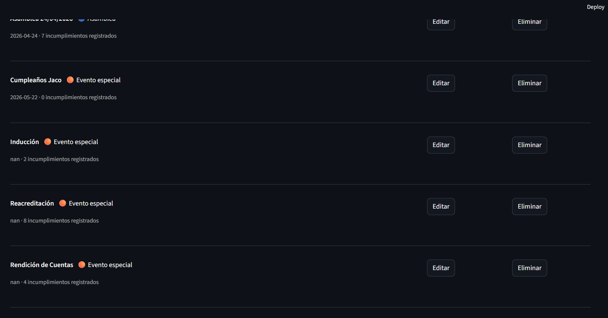
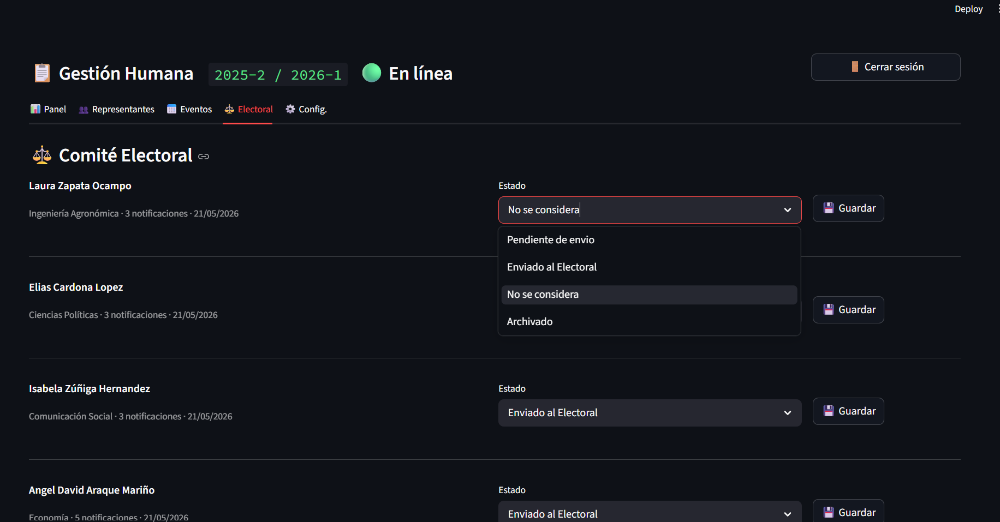
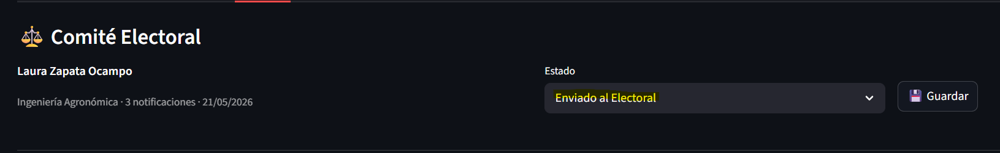
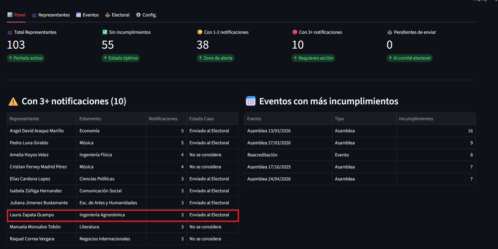
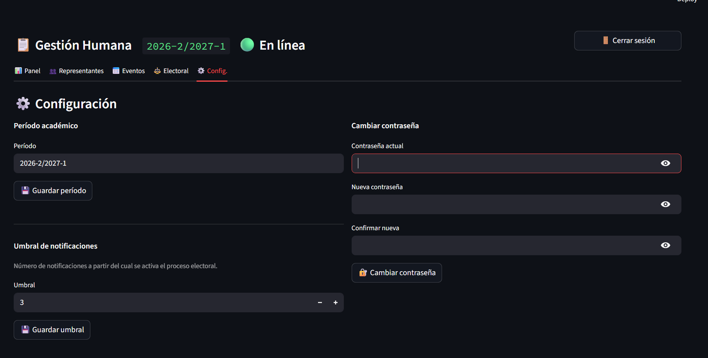

# Proyecto final - Introducción al BI

**Por:** Jacobo Cartagena Gaviria

**Caso de negocio:** Representantes estudiantiles EAFIT

## ¿De qué trata mi sistema?

Yo soy coordinador de gestión humana de los representantes estudiantiles, ya estoy dejando mi cargo, pero desde siempre tuve en mente esta idea que me hubiera hecho más fácil la vida, y se lo quiero dejar a los próximos coordinadores para que sea más fácil para ellos. Una de mis responsabilidades es mostrarles a los representantes de manera transparente y privada la cantidad de notificaciones de incumplimiento que ellos tengan acumuladas a lo largo de su periodo. Entonces diseñe un sistema de monitoreo de notificaciones de incumplimiento para representantes estudiantiles.

## ¿Cómo funciona?

Los representantes tienen que ir por obligación a las asambleas ordinarias y eventos citados por desarrollo estudiantil. Cuando un representante falta sin justificación, el coordinador de gestión humana le registra una notificación de incumplimiento.

**Las reglas que tiene esto anterior son:**

* Cada notificación está asociada a un evento específico (una asamblea, una capacitación, un evento de desarrollo).
* Si un representante acumula 3 o más notificaciones, su caso se eleva automáticamente al Comité Electoral para evaluación.
* Los representantes pueden consultar en cualquier momento cuántas notificaciones llevan (de forma privada).
* El coordinador tiene que tener el control de prácticamente todo. Quién tiene cuántas, cuáles casos ya fueron enviados al comité y cuáles están en riesgo.

## ¿Justifica 4 tablas? Claro que sí

Yo lo diseñe de esta forma:

### **REPRESENTANTES**
* Cada persona que ocupa un cargo y su estamento
* **Restricciones:** PRIMARY KEY (id_representante), NOT NULL en nombres y documento.

### **EVENTOS** 
* Cada asamblea o actividad a la que deben asistir
* **Restricciones:** PRIMARY KEY (id_evento), UNIQUE en nombre_evento.

### **NOTIFICACIONES**
* Cada incumplimiento registrado (representantes + eventos)
* **Restricciones:** FOREIGN KEY (id_representante, id_evento), NOT NULL en fecha_notificacion.

### **CASOS ELECTORAL**
* Los casos llevados al comité electoral por acumulación
* **Restricciones:** PRIMARY KEY (id_caso), CHECK (estado en ('Pendiente', 'Enviado', 'Cerrado')).

## **Explicación del Diagrama y Relaciones**
El modelo está diseñado para reflejar el flujo real de gestión de incumplimientos de todos los repres:

**REPRESENTANTES a NOTIFICACIONES:** Un representante puede acumular muchas notificaciones a lo largo de su periodo si falta a distintos eventos.

**EVENTOS a NOTIFICACIONES:** Un solo evento (como una asamblea ordinaria) puede generar múltiples notificaciones si varios representantes faltan al mismo tiempo.

**REPRESENTANTES a CASO_ELECTORAL:** Se establece una relación directa porque, al final del día, el proceso ante el comité es una responsabilidad individual de cada representante.

**NOTIFICACIONES a CASO_ELECTORAL:** Esta es la relación clave que valida el sistema. La acumulación de registros en NOTIFICACIONES es el "disparador" que justifica la creación de un registro en CASO_ELECTORAL, vinculando técnicamente las faltas cometidas con la apertura del proceso sancionatorio.

## **Integridad**
Implementé llaves primarias (PK) en todas las tablas y llaves foráneas (FK) para garantizar la integridad referencial en todo el sistema. Específicamente, definí también llaves foráneas en las tablas NOTIFICACIONES y CASO_ELECTORAL, lo que impide la creación de registros huérfanos y asegura que no existan notificaciones o casos sin un representante o evento válido asociado.

## Reglas de negocio
1. **Regla de acumulación:** Si un representante acumula 3 o más notificaciones, el sistema debe elevar el caso al Comité Electoral.
2. **Unicidad de caso:** Un representante solo puede tener un caso activo en el Comité Electoral a la vez.
3. **Validación de inasistencia:** Solo el coordinador de gestión humana puede registrar y gestionar todos los incumplimientos, garantizando un control centralizado.

## Instrucciones para ejecutar la aplicación
1. Clonar el repositorio.
2. Crear un entorno virtual: `python -m venv .venv`
3. Instalar dependencias: `pip install -r requirements.txt`
4. Ejecutar la aplicación: `streamlit run app.py`

**IMPORTANTE:** Para usar la versión de coordinador la contraseña es: gestion2025
Así se desbloquean todo el resto de opciones

## ¿Cómo funciona la aplicación?

El sistema cuenta con dos perfiles de usuario, cada uno con funciones específicas para asegurar la transparencia y el control:

### Para Representantes Estudiantiles
Los representantes pueden consultar su situación en tiempo real de forma privada:
* **Consulta de Historial:** Al ingresar su identificación, el sistema despliega el listado completo de todos sus incumplimientos registrados, incluyendo fecha y evento asociado.
* **Estado Actual:** Visualización clara de cuántas notificaciones vigentes tienen acumuladas, permitiéndoles conocer si están próximos a una sanción.

### Para el Administrador (Coordinador de Gestión Humana)
El coordinador tiene el control total sobre la base de datos para asegurar el flujo de información:
* **Registro de Incumplimientos:** Interfaz para crear nuevas notificaciones vinculando representante, evento y motivo de la falta.
* **Monitoreo de Riesgo:** Visualización de la lista de "Representantes en riesgo" (aquellos con 2 notificaciones), permitiendo una intervención preventiva.
* **Gestión del Comité Electoral:** Control de los casos elevados al comité. El administrador puede verificar el estado de cada caso y actualizarlo a medida que el proceso avanza.
* **Seguridad:** Gestión de credenciales para realizar cambios en el sistema.

## 📸 Capturas de pantalla del sistema
Aquí se demuestra el funcionamiento del sistema en diferentes escenarios:

**1. Pantalla principal (Dashboard)**

* En este pantel principal podemos observar todo desde la visión del administrador, todos los datos importantes están aquí recopilados gracias a las consultas que creé.

**2. Gestión de representantes**

* Aquí podemos ver que se pueden cambiar los representantes, para añadir representantes nuevos, consultar los actuales, registrarles notificaciones de incumplimiento poniendo el motivo y fecha.

**3. Creación de eventos**

* Aquí pruebo la funcionalidad de la gestión de eventos, se pueden eliminar, crear y modificar eventos. La idea de esto es que para los próximos representantes tengan que cambiar todo, les sea mucho más fácil borrar los datos y empezar de nuevo.

**4. Detalle de evento creado**

* Como vieron en la imágen anterior, cree un evento llamado "Cumpleaños Jaco" y efectivamente se guarda como un evento nuevo.

**5. Vista de representantes en riesgo**

* En esta imagen podemos ver los representantes y su situación electoral. Se puede cambiar y cuando se da guardar se actualiza automáticamente y el cambio se ve reflejado en el panel principal también.

**6. Cambio de situación electoral**

* Aquí podemos ver un ejemplo, de cuando cambio el estado de Laura Zapata a "Enviado al electoral" y en la siguiente imágen podrán ver que en el dashboard queda actualizado.

**7. Actualización de caso electoral**

* Aquí se ve el dashboard actualizado con el cambio de Laura Zapata que fue enviada por nosotros al electoral.

**8. Configuración del sistema**

* Aquí el administrador tiene control sobre todos los parámetros del sistema, como el periodo académico, vital para la gestión administrativa y por si algo en el futuro llega a cambiar. Aparte el cambio de contraseña de coordinador para los próximos coordinadores en varios periodos.

**9. Umbral de notificaciones**

* El sistema también permite al administrador configurar el "Umbral" (actualmente en 3). Esto demuestra que el sistema es dinámico y no tiene reglas fijas, cumpliendo con la regla de negocio que dispara el caso ante el comité.

## Reflexión del equipo (Dificultades y aprendizajes)
* **Dificultades:** Yo hice este mismo ejercicio utilizando Firebase y React, que son plataformas que creo que me ayudan más a sostener la base de datos por un tiempo más prologado y no cambian tanto sus terminos y condiciones de seguridad...etc. Creo que me sirvió mucho hacerlo en Oracle y Pycharm, porque le da una perspectiva muy diferente a la forma de ejecutar el aplicativo.
* Me aparecieron muchos errores sobre todo relacionados con la conexión, pero de resto no tuve ninguna otra dificultad. Me apoyé bastante en la IA iterando los resultados que me daba para que la página se viera lo más parecida posible.
* Lo que más me costó fue el diseño del ERD, porque la verdad como es un caso de "negocio" muy diferente, me costó mucho el saber explicar bien las relaciones que tenía cada tabla
* La página donde lo hice para mi coordinación en la vida real se llama Netlify con HTML, considero que se ve mejor estéticamente pero tiene literalmente las mismas funciones: https://notificacionesrepres.netlify.app/
* **Aprendizajes:** Mi mayor aprendizaje de todo este proceso es ver la cantidad de posibilidades que se tiene para construir aplicaciones apoyadas por bases de datos. Me fui a investigar y resulta que hay muchas formas de llegar a este mismo resultado. Y también es de tener el conocimiento, porque si uno no sabe que restricciones poner, ni como organizar todo, la IA o cualquier ayudante te va a dar cualquier cosa.
* Para mi fue super retador, pero siento que a su vez, tengo la satisfacción de haber hecho un trabajo muy completo, donde aprendí y reforcé lo visto en clase pero también sé que va a ser útil para los verdaderos representantes estudiantiles de la universidad.